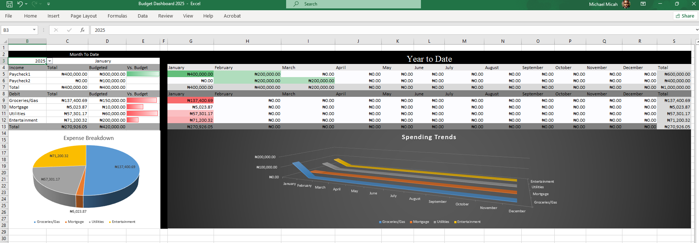
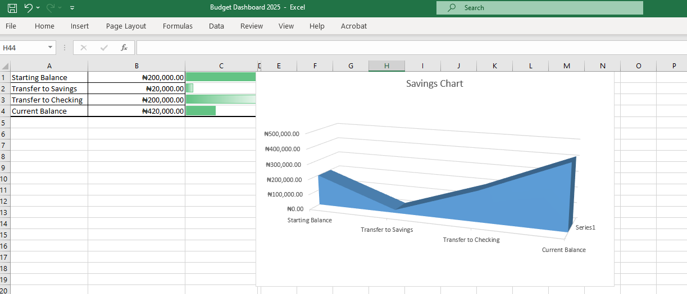

# Budget Dashboard  

A visually interactive **Budget Dashboard** built in Microsoft Excel to help you track your finances, visualize your spending patterns, and stay on top of your savings goals.  

## 📊 Features  
- **Dynamic Visualizations**: Automatically generated charts and graphs for income, expenses, and savings.  
- **Savings Progress Tracker**: Monitor your progress toward achieving your savings goals with intuitive visuals.  
- **Category Breakdown**: View detailed spending patterns by customizable categories.  
- **Monthly Summary**: A clear snapshot of your income, expenses, and balance for each month.  
- **Customizable Dashboard**: Tailor the dashboard to suit your unique financial needs.  

## 🖼️ Visual Previews  

### Dashboard Overview  
  
*An interactive dashboard showcasing your income, expenses, and savings progress.*    

### Savings Tracker  
  
*Track your savings progress with visual indicators and trend analysis.*  

## 🛠️ How to Use  
1. **Download the File**: Clone this repository or download the `.xlsx` file directly.  
2. **Input Your Data**:  
   - Fill out your income and expense records in the designated sheets.  
   - Update your savings goals and progress.  
3. **Explore the Dashboard**:  
   - Visualizations will update automatically as you input your data.  
   - Use filters and slicers (if available) for deeper insights.  
4. **Customize Categories**: Adjust spending categories and chart settings as needed.  

## 📂 Repository Contents  
- `Budget_Dashboard.xlsx`: The main Excel file containing the budget dashboard.  
- `README.md`: Instructions and details about the project.  
- `images/`: Folder containing image previews for the dashboard.  

## 🚀 Features Under Development  
- Add support for advanced filtering options.  
- Include annual summaries for long-term financial tracking.  
- Enhance visualizations with additional chart types.  

## 🤝 Contribution  
Contributions, suggestions, and feedback are welcome!  
- Fork this repository and submit a pull request.  
- Open an issue to report bugs or suggest features.  

## 📄 License  
This project is licensed under the [MIT License](LICENSE). Feel free to use and modify it for your personal or professional needs.  

## 💬 Contact  
For questions or assistance, feel free to open an issue in this repository.  

---

Transform the way you manage your finances with this interactive Budget Dashboard! 🚀  
